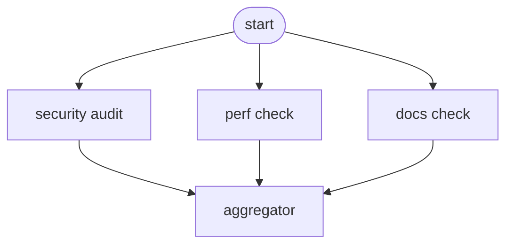
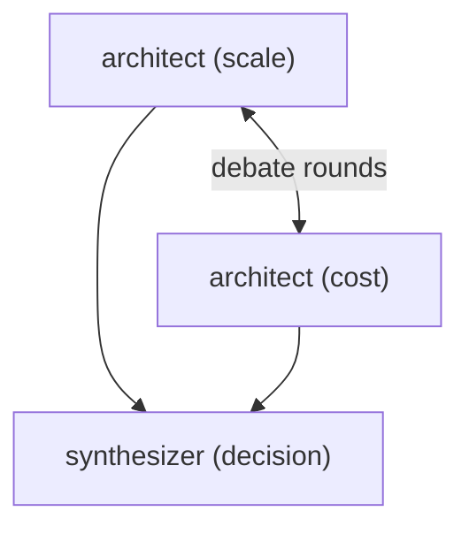
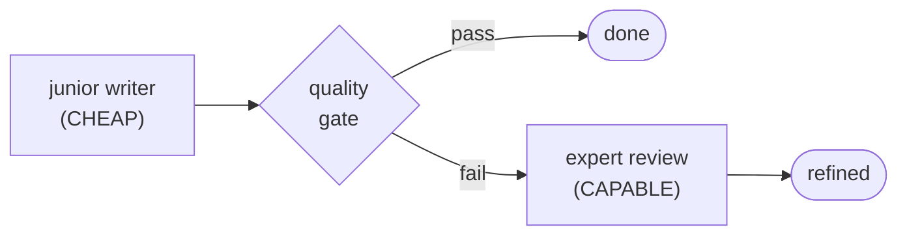
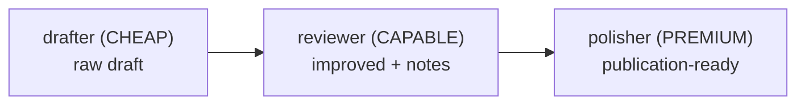
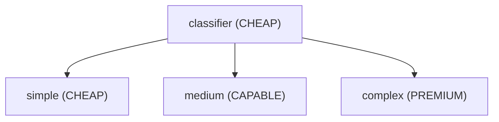

# Building Agent Teams: From Words to Sentences

**Date:** January 2026
**Author:** Patrick Roebuck
**Tags:** AI, Multi-Agent Systems, Composition Patterns, Python, LLM
**Series:** Grammar of AI Collaboration (Part 3 of 4)

---

*How composition patterns transform individual agents into collaborative teams.*

---

Part 3 of the Grammar of AI Collaboration series.

In [Part 1](08-grammar-of-ai-collaboration.md), we introduced the grammar metaphor. In [Part 2](09-dynamic-agent-creation.md), we explored how agents spawn dynamically. Now we tackle the heart of the system: **composition patterns**—the grammar rules that turn individual agents into coordinated teams.

## Why Composition Matters

Having great agents isn't enough. Consider:

```
🤖 Security Auditor: "Found 3 critical vulnerabilities"
🤖 Code Reviewer: "Code quality is excellent"
🤖 Test Analyzer: "Coverage is 45%"

❓ Human: "Should I release?"
```

Three agents, three perspectives, no synthesis. Who resolves conflicts? Who prioritizes? Who decides?

**Composition patterns answer these questions.**

## The 6 Core Patterns

Think of these as the verbs of agent orchestration—they describe *how* agents collaborate:

| Pattern | Shape | Good for |
|---|---|---|
| Sequential | A → B → C | Pipeline, dependencies |
| Parallel | A ‖ B ‖ C | Independent, speed |
| Debate | A ⇄ B → Synth | Multiple perspectives |
| Teaching | Junior → Expert | Cost + quality |
| Refinement | Draft → Polish | Iterative improvement |
| Adaptive | Route → Spec | Right-size by complexity |

Let's explore each one.

---

## Pattern 1: Sequential (A → B → C)

**When to use:** Each step depends on the previous step's output.

```
coverage_analyzer → test_generator → quality_validator
       ↓                  ↓                  ↓
  "45% coverage"    "15 new tests"    "All tests pass"
```

### Implementation

```python
class SequentialStrategy(ExecutionStrategy):
    """Execute agents one after another, passing results forward."""

    async def execute(
        self,
        agents: list[Agent],
        context: dict
    ) -> StrategyResult:
        results = []
        current_context = context.copy()

        for agent in agents:
            # Execute agent with accumulated context
            result = await agent.execute(current_context)
            results.append(result)

            # Pass results forward
            current_context = {**current_context, **result.output}

        return StrategyResult(
            success=all(r.success for r in results),
            outputs=results,
            aggregated_output=current_context,
            total_duration=sum(r.duration for r in results)
        )
```

### Real-World Example: Test Coverage Boost

```python
# Define the team
team = AgentTeam(
    agents=[
        spawn("coverage_analyzer", focus="auth module"),
        spawn("test_generator", style="pytest"),
        spawn("quality_validator", min_score=0.8)
    ],
    strategy="sequential"
)

# Execute
result = await team.execute({
    "code_path": "src/auth/",
    "target_coverage": 80
})

# Flow:
# 1. coverage_analyzer identifies gaps → {gaps: ["login", "logout", "refresh"]}
# 2. test_generator receives gaps → {tests: ["test_login.py", ...]}
# 3. quality_validator receives tests → {quality_score: 0.92, passed: True}
```

**Strengths:** Clear dependencies, traceable flow, each agent has full context from predecessors.

**Weaknesses:** Slow (serial execution), one failure stops the pipeline.

---

## Pattern 2: Parallel (A ‖ B ‖ C)

**When to use:** Independent checks that can run simultaneously.



### Implementation

```python
class ParallelStrategy(ExecutionStrategy):
    """Execute all agents simultaneously, aggregate results."""

    async def execute(
        self,
        agents: list[Agent],
        context: dict
    ) -> StrategyResult:
        # Launch all agents concurrently
        tasks = [agent.execute(context) for agent in agents]
        results = await asyncio.gather(*tasks, return_exceptions=True)

        # Handle failures
        successful = [r for r in results if not isinstance(r, Exception)]
        failed = [r for r in results if isinstance(r, Exception)]

        return StrategyResult(
            success=len(failed) == 0,
            outputs=successful,
            aggregated_output=self._aggregate(successful),
            total_duration=max(r.duration for r in successful),
            errors=failed
        )

    def _aggregate(self, results: list[AgentResult]) -> dict:
        """Combine results with weighted scoring."""
        combined = {}
        for result in results:
            for key, value in result.output.items():
                combined[f"{result.agent_id}.{key}"] = value

        # Calculate overall score
        scores = [r.output.get("score", 0) for r in results]
        combined["overall_score"] = sum(scores) / len(scores)

        return combined
```

### Real-World Example: Release Preparation

```python
# Define parallel checks
team = AgentTeam(
    agents=[
        spawn("security_auditor", severity="high"),
        spawn("performance_validator", sla="100ms"),
        spawn("documentation_checker", completeness=0.9),
        spawn("test_coverage_analyzer", target=80)
    ],
    strategy="parallel"
)

# Execute - all run at once
result = await team.execute({"release_candidate": "v4.4.0"})

# Aggregated result:
# {
#     "security_auditor.vulnerabilities": 0,
#     "security_auditor.score": 95,
#     "performance_validator.p99_latency": 82,
#     "performance_validator.score": 90,
#     "documentation_checker.completeness": 0.94,
#     "documentation_checker.score": 94,
#     "test_coverage_analyzer.coverage": 87,
#     "test_coverage_analyzer.score": 87,
#     "overall_score": 91.5  # Weighted average
# }
```

**Strengths:** Fast (parallel execution), comprehensive (multiple perspectives).

**Weaknesses:** No inter-agent communication, all agents see same input.

---

## Pattern 3: Debate (A ⇄ B → Synthesis)

**When to use:** Complex decisions needing multiple expert perspectives.



### Implementation

```python
class DebateStrategy(ExecutionStrategy):
    """Multiple perspectives with synthesis."""

    def __init__(self, rounds: int = 2, synthesizer: Agent | None = None):
        self.rounds = rounds
        self.synthesizer = synthesizer

    async def execute(
        self,
        agents: list[Agent],
        context: dict
    ) -> StrategyResult:
        debate_history = []
        current_context = context.copy()

        # Debate rounds
        for round_num in range(self.rounds):
            round_results = []

            for agent in agents:
                # Agent sees other agents' previous responses
                agent_context = {
                    **current_context,
                    "debate_history": debate_history,
                    "round": round_num + 1
                }
                result = await agent.execute(agent_context)
                round_results.append(result)

            debate_history.append({
                "round": round_num + 1,
                "responses": [r.output for r in round_results]
            })

        # Synthesis
        if self.synthesizer:
            synthesis_context = {
                **context,
                "debate_history": debate_history
            }
            synthesis = await self.synthesizer.execute(synthesis_context)
            return StrategyResult(
                success=True,
                outputs=debate_history,
                aggregated_output=synthesis.output,
                total_duration=sum(...)
            )

        return self._auto_synthesize(debate_history)
```

### Real-World Example: Architecture Decision

```python
# Define debaters
team = AgentTeam(
    agents=[
        spawn("architect", focus="scalability"),
        spawn("architect", focus="cost_efficiency"),
        spawn("architect", focus="simplicity")
    ],
    strategy=DebateStrategy(
        rounds=2,
        synthesizer=spawn("decision_maker", style="consensus")
    )
)

# Execute debate
result = await team.execute({
    "decision": "How should we handle caching?",
    "constraints": ["budget: $500/mo", "latency: <50ms", "team_size: 3"]
})

# Debate flow:
# Round 1:
#   scale_architect: "Use Redis cluster for horizontal scaling"
#   cost_architect: "In-memory cache sufficient, Redis overkill"
#   simple_architect: "Start with functools.lru_cache"
#
# Round 2 (responds to each other):
#   scale_architect: "lru_cache doesn't share across instances"
#   cost_architect: "Single Redis instance balances cost/capability"
#   simple_architect: "Agree with single Redis, simpler than cluster"
#
# Synthesis:
#   "Recommendation: Single Redis instance with local LRU fallback.
#    Rationale: Balances scalability needs with cost constraints.
#    Migration path: Start simple, scale cluster when >1000 RPS."
```

**Strengths:** Rich decision-making, surfaces trade-offs, reduces single-agent bias.

**Weaknesses:** Expensive (multiple rounds × multiple agents), slower.

---

## Pattern 4: Teaching (Junior → Expert Validation)

**When to use:** Cost optimization with quality assurance.



### Implementation

```python
class TeachingStrategy(ExecutionStrategy):
    """Junior generates, expert validates/refines."""

    def __init__(
        self,
        junior: Agent,
        expert: Agent,
        quality_threshold: float = 0.8
    ):
        self.junior = junior
        self.expert = expert
        self.threshold = quality_threshold

    async def execute(
        self,
        agents: list[Agent],  # Ignored, uses junior/expert
        context: dict
    ) -> StrategyResult:
        # Junior attempt (cheap tier)
        junior_result = await self.junior.execute(context)

        # Quality check
        quality_score = self._assess_quality(junior_result)

        if quality_score >= self.threshold:
            # Passed! Junior output sufficient
            return StrategyResult(
                success=True,
                outputs=[junior_result],
                aggregated_output=junior_result.output,
                metadata={"tier_used": "CHEAP", "expert_needed": False}
            )

        # Expert refinement needed
        expert_context = {
            **context,
            "junior_output": junior_result.output,
            "quality_issues": self._identify_issues(junior_result)
        }
        expert_result = await self.expert.execute(expert_context)

        return StrategyResult(
            success=True,
            outputs=[junior_result, expert_result],
            aggregated_output=expert_result.output,
            metadata={"tier_used": "CAPABLE", "expert_needed": True}
        )
```

### Real-World Example: Documentation Generation

```python
# Cost-optimized documentation
strategy = TeachingStrategy(
    junior=spawn("documentation_writer", tier="CHEAP"),
    expert=spawn("documentation_writer", tier="CAPABLE"),
    quality_threshold=0.85
)

result = await strategy.execute([], {
    "code": api_module,
    "style": "technical",
    "audience": "developers"
})

# Scenario A: Junior passes (85%+ quality)
#   → Cost: $0.002 (Haiku only)
#   → Output: Junior's documentation
#
# Scenario B: Junior fails (< 85% quality)
#   → Cost: $0.002 + $0.015 = $0.017 (Haiku + Sonnet)
#   → Output: Expert-refined documentation
```

**Cost savings:** 60-80% when junior passes frequently.

**Strengths:** Cost-effective, quality maintained, automatic escalation.

**Weaknesses:** Requires good quality assessment, two-tier latency on escalation.

---

## Pattern 5: Refinement (Draft → Review → Polish)

**When to use:** Iterative improvement for high-quality output.



### Implementation

```python
class RefinementStrategy(ExecutionStrategy):
    """Progressive quality improvement ladder."""

    def __init__(self, stages: list[tuple[Agent, str]]):
        # [(agent, role), ...]
        self.stages = stages

    async def execute(
        self,
        agents: list[Agent],
        context: dict
    ) -> StrategyResult:
        current_output = None
        stage_results = []

        for agent, role in self.stages:
            stage_context = {
                **context,
                "previous_output": current_output,
                "role": role,
                "stage": len(stage_results) + 1
            }

            result = await agent.execute(stage_context)
            stage_results.append(result)
            current_output = result.output

        return StrategyResult(
            success=True,
            outputs=stage_results,
            aggregated_output=current_output,  # Final polished version
            metadata={"stages_completed": len(stage_results)}
        )
```

### Real-World Example: API Documentation Pipeline

```python
strategy = RefinementStrategy(stages=[
    (spawn("doc_writer", tier="CHEAP"), "drafter"),
    (spawn("doc_reviewer", tier="CAPABLE"), "reviewer"),
    (spawn("doc_editor", tier="PREMIUM"), "polisher")
])

result = await strategy.execute([], {
    "code": payment_api,
    "standard": "OpenAPI 3.0"
})

# Stage 1 - Drafter (CHEAP):
#   "Generates basic structure, extracts endpoints"
#
# Stage 2 - Reviewer (CAPABLE):
#   "Adds examples, improves descriptions, checks accuracy"
#
# Stage 3 - Polisher (PREMIUM):
#   "Perfects language, ensures consistency, adds edge cases"
```

**Strengths:** Highest quality output, clear improvement stages.

**Weaknesses:** Most expensive, slowest, not always necessary.

---

## Pattern 6: Adaptive Routing (Classifier → Specialist)

**When to use:** Variable complexity tasks that need right-sizing.



### Implementation

```python
class AdaptiveStrategy(ExecutionStrategy):
    """Route to appropriate specialist based on complexity."""

    def __init__(
        self,
        classifier: Agent,
        specialists: dict[str, Agent]  # complexity → agent
    ):
        self.classifier = classifier
        self.specialists = specialists

    async def execute(
        self,
        agents: list[Agent],
        context: dict
    ) -> StrategyResult:
        # Classify task complexity (cheap operation)
        classification = await self.classifier.execute(context)
        complexity = classification.output["complexity"]

        # Route to appropriate specialist
        specialist = self.specialists.get(complexity)
        if not specialist:
            specialist = self.specialists["default"]

        result = await specialist.execute({
            **context,
            "classification": classification.output
        })

        return StrategyResult(
            success=result.success,
            outputs=[classification, result],
            aggregated_output=result.output,
            metadata={
                "classified_as": complexity,
                "specialist_used": specialist.id
            }
        )
```

### Real-World Example: Bug Triage

```python
strategy = AdaptiveStrategy(
    classifier=spawn("bug_classifier", tier="CHEAP"),
    specialists={
        "simple": spawn("bug_fixer", tier="CHEAP"),      # Typos, config
        "moderate": spawn("bug_fixer", tier="CAPABLE"),   # Logic errors
        "complex": spawn("bug_fixer", tier="PREMIUM"),    # Architecture issues
        "default": spawn("bug_fixer", tier="CAPABLE")
    }
)

# Bug: "Login button doesn't work"
result = await strategy.execute([], {"bug_report": bug})

# Classifier: "simple" (missing event handler)
# → Routes to CHEAP tier fixer
# → Cost: $0.005
#
# Bug: "Race condition in payment processing"
# Classifier: "complex" (concurrency issue)
# → Routes to PREMIUM tier fixer
# → Cost: $0.10
```

**Strengths:** Cost-optimized, right-sized automatically.

**Weaknesses:** Classifier accuracy is critical, misclassification wastes resources.

---

## Choosing the Right Pattern

| Scenario | Recommended Pattern |
|----------|---------------------|
| Steps depend on each other | **Sequential** |
| Independent validations | **Parallel** |
| Need multiple expert opinions | **Debate** |
| Cost matters, quality negotiable | **Teaching** |
| Highest quality required | **Refinement** |
| Variable task complexity | **Adaptive** |

### Pattern Selection Heuristic

```python
def select_pattern(requirements: TaskRequirements) -> str:
    # Dependencies → Sequential
    if requirements.has_dependencies:
        return "sequential"

    # Multiple perspectives needed → Debate
    if requirements.needs_consensus:
        return "debate"

    # Cost-sensitive → Teaching or Adaptive
    if requirements.cost_sensitive:
        if requirements.variable_complexity:
            return "adaptive"
        return "teaching"

    # Highest quality → Refinement
    if requirements.quality_critical:
        return "refinement"

    # Default: Parallel for speed
    return "parallel"
```

## Combining Patterns

Patterns can be nested. A release preparation workflow might use:

```
parallel([
    sequential([coverage_analyzer, test_generator, validator]),
    teaching(junior_security, expert_security),
    debate([arch_scale, arch_cost], synthesizer)
]) → weighted_aggregation
```

This creates a sophisticated team that:
1. Runs test boost sequentially (dependencies)
2. Runs security with cost optimization (teaching)
3. Debates architecture decisions (debate)
4. All three branches run in parallel (parallel outer)

## What's Next

In **Part 4: Advanced Grammar**, we explore the newest patterns: conditional branching, nested workflows, and learning grammar that improves from experience.

---

*Composition pattern code is available in [Attune AI v4.4.0](https://github.com/Smart-AI-Memory/empathy).*

*Patrick Roebuck is the creator of the Attune AI. Follow [@DeepStudyAI](https://twitter.com/DeepStudyAI) for updates.*
