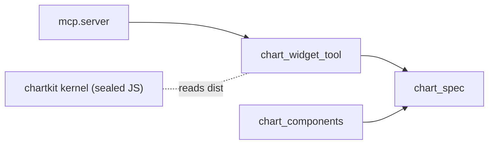
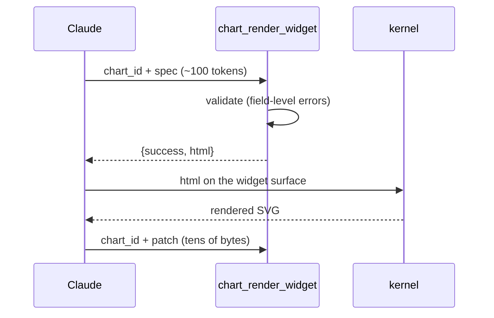
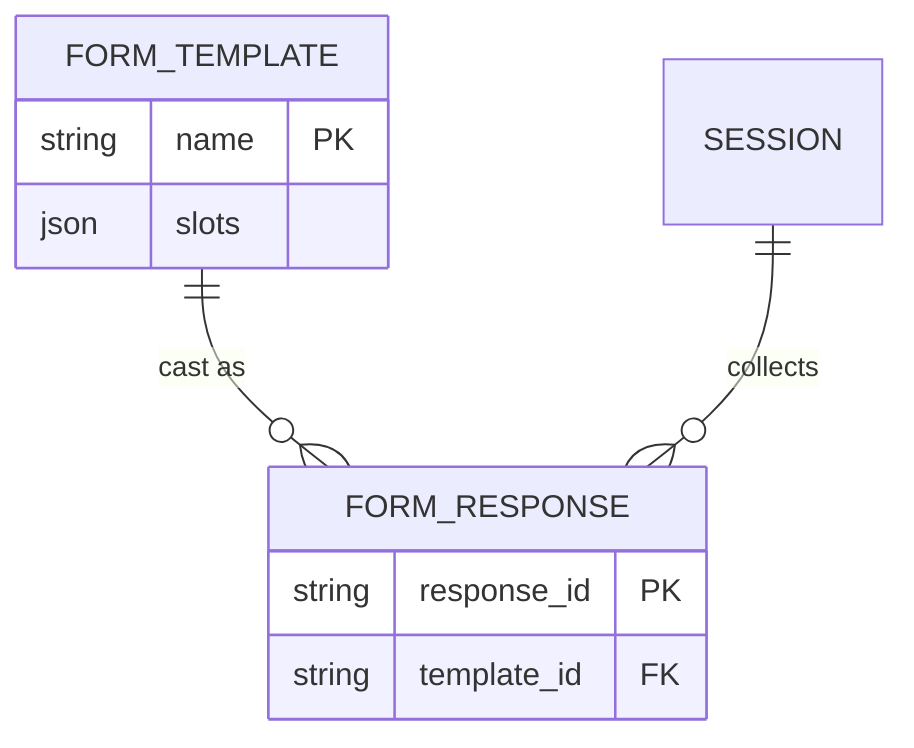
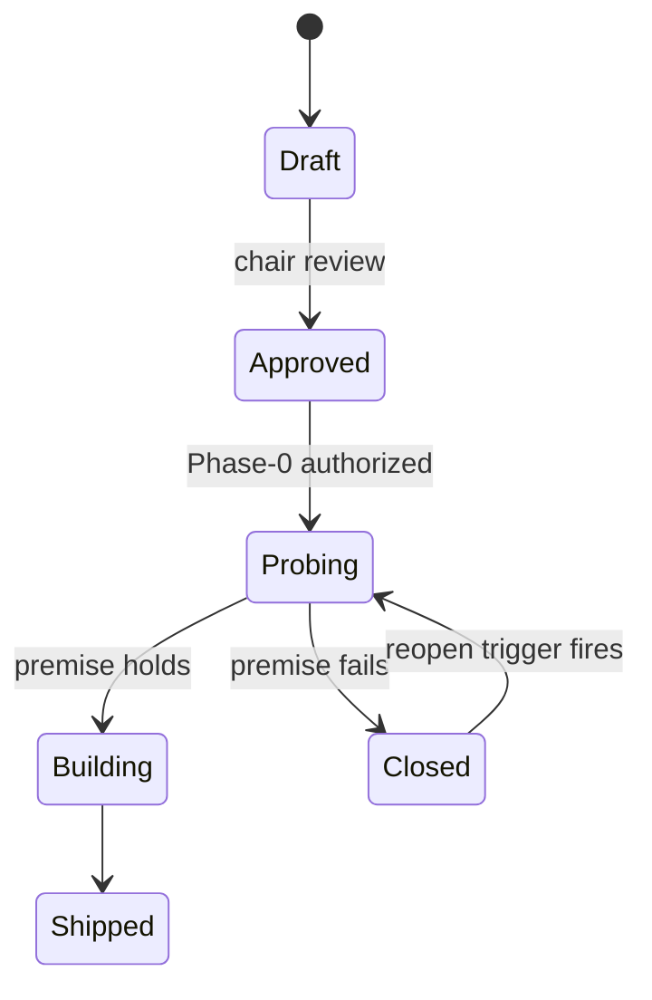

# Diagrams — structure is mermaid's job

chartkit draws *quantity* (nine chart types from a JSON spec — see
[Chart Widgets](chartkit.md)). For *structure* — modules, flows,
schemas, states — the ruled answer is **mermaid**: measured 1.2–2.1×
cheaper to author than a widget spec, and it renders natively on
GitHub (READMEs, PRs, issues), on this docs site, and in Claude
artifacts. No build, no supplement. (The ruling and the measured
probes live in `docs/specs/diagramkit/decisions.md`.)

Every example below is a live render — view this page's source to
copy the fence.

## Software structure — `flowchart`

Modules and their dependencies:

## Interactions — `sequenceDiagram`

Who calls whom, in order — protocols, API flows:

## Databases — `erDiagram`

Entities, relationships, cardinality:

## Lifecycles — `stateDiagram-v2`

State machines — a spec's life, a job's phases:

## More types

`classDiagram` (UML), `gantt` (schedules), `gitGraph` (branch
topology), `timeline`, C4 context diagrams, and network/cloud
`architecture` diagrams — see the
[mermaid documentation](https://mermaid.js.org/intro/) for the full
set. All render anywhere the four above do.

## When NOT mermaid

- **Quantitative shape** — trends, distributions, comparisons:
  that's [chartkit](chartkit.md); mermaid's chart types are
  rudimentary.
- **Diagrams a session updates in place** — a status DAG patched
  turn by turn. That niche was probed and closed 2026-08-06
  ("mermaid wins" — reopen on a second real occurrence; see the
  diagramkit spec).
- **Notation-exact standards** — symbol-true BPMN, vendor network
  stencils. Mermaid approximates; if exactness is ever required,
  that is an embed-a-specialized-renderer decision, not a mermaid
  fence.
