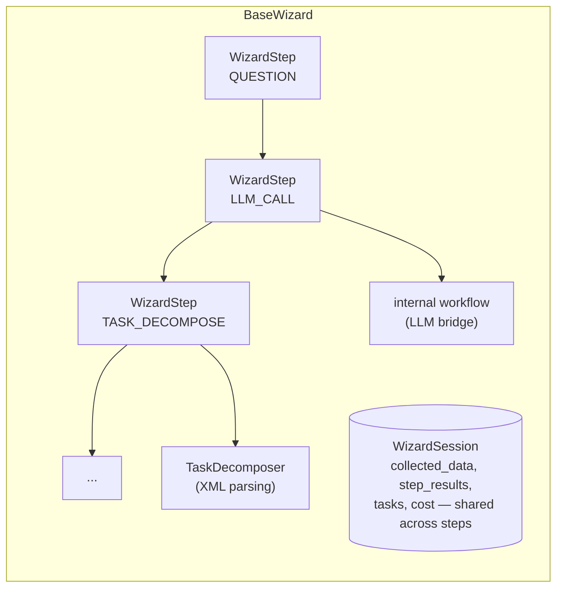
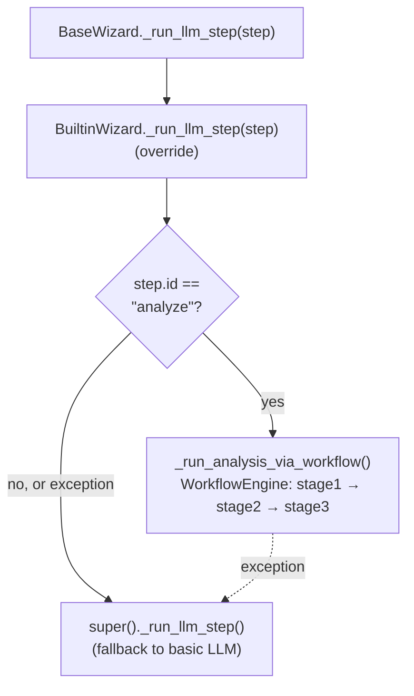

# Wizard Architecture

How the wizard system works internally: components, step lifecycle, session state, and workflow delegation.

---

## System Overview

The wizard system provides guided, multi-step AI workflows. Users interact with wizards through questions, and the system orchestrates LLM calls, task decomposition, and previews behind a consistent interface.



---

## Core Components

### BaseWizard (`base.py`)

Abstract base class that all wizards extend. Defines:

- **`config`** — `WizardConfig` with wizard_id, name, description, domain, cost estimates
- **`steps`** — Ordered list of `WizardStep` definitions
- **`run()`** — Main entry point that iterates steps and dispatches each one
- **`build_prompt_context()`** — Abstract: subclasses build `PromptContext` for LLM steps
- **`process_step_result()`** — Abstract: subclasses store/transform LLM results

### WizardStep (`base.py`)

Each step has:

| Field | Type | Purpose |
|-------|------|---------|
| `id` | `str` | Unique step identifier |
| `name` | `str` | Human-readable label |
| `step_type` | `StepType` | Determines execution handler |
| `tier` | `str` | Model tier: `"cheap"`, `"capable"`, `"premium"` |
| `questions` | `list[FormQuestion]` | For QUESTION steps only |
| `condition` | `Callable` | Skip this step if returns `False` |
| `prompt_template` | `str` | XML template name for LLM steps |
| `prompt_context_template` | `dict` | Declarative prompt context (YAML wizards) |

### StepType Enum

```text
QUESTION       → Collect user input via AskUserQuestion
LLM_CALL       → Call an LLM with XML-enhanced prompt
TASK_DECOMPOSE → Break work into structured XML <task> specs
PREVIEW        → Show results for review
CONFIRM        → Final yes/no gate
```

### WizardSession (`session.py`)

Mutable state container shared across all steps in a single run.

```text
WizardSession
├── wizard_id          # Which wizard owns this session
├── run_id             # Unique run ID (UUID)
├── initial_context    # Read-only context from run() caller
├── collected_data     # User answers from QUESTION steps
├── step_results       # LLM/decompose outputs keyed by step ID
├── tasks              # Decomposed XML tasks
├── steps_completed    # Ordered list of completed step IDs
├── steps_skipped      # Steps skipped due to conditions
├── generated_output   # Final preview text
└── total_cost         # Accumulated LLM cost (USD)
```

**Layered lookup:** `session.get(key)` checks `collected_data` first, then falls back to `initial_context`. This lets QUESTION steps override initial values.

### WizardResult (`base.py`)

Returned by `run()`. Contains everything needed by the caller:

- `success` — Whether the wizard completed
- `steps_completed` — Which steps ran
- `collected_data` — All user inputs
- `generated_output` — Preview text or analysis
- `tasks` — Decomposed task list
- `total_cost` / `total_duration_ms` — Usage metrics
- `error` — Error message if `success` is `False`

---

## Step Lifecycle

### 1. Dispatch

`BaseWizard.run()` iterates through `self.steps` in order. For each step:

1. Check the step's `condition` callable (if any). If it returns `False`, skip via `session.skip_step()`.
2. Call `_dispatch_step()`, which routes to the handler by `step_type`.

### 2. QUESTION Steps

```text
User ──AskUserQuestion──→ FormEngine ──responses──→ Session.set()
```

- Creates a `FormSchema` from the step's `questions` list
- Passes it to `SocraticFormEngine.ask_questions()`
- Stores each response key-value pair in the session
- When no callback is provided, uses question defaults

### 3. LLM_CALL Steps

```text
Session ──build_prompt_context()──→ PromptContext
                                      │
         WizardInternalWorkflow._render_xml_prompt()
                                      │
         WizardInternalWorkflow._call_llm(prompt, tier)
                                      │
         WizardInternalWorkflow._parse_xml_response()
                                      │
                                 process_step_result()
                                      │
                              Session.complete_step()
```

- Subclass provides `PromptContext` via `build_prompt_context()`
- Internal workflow renders XML prompt, calls LLM, parses response
- Subclass processes result via `process_step_result()`
- **Workflow delegation** (see below) can override this entire flow

### 4. TASK_DECOMPOSE Steps

- Instantiates `TaskDecomposer` with the internal workflow
- Calls `decompose()` with problem description and constraints from `build_prompt_context()`
- LLM produces XML `<task>` blocks; regex parser extracts `DecomposedTask` objects
- Task dicts stored in `session.tasks`

### 5. PREVIEW Steps

- Formats session state (inputs, analysis, tasks) into markdown
- Stores as `session.generated_output`
- In interactive mode, the CLI or Claude Code displays this to the user

### 6. CONFIRM Steps

- Presents a yes/no question via the form engine
- If declined, raises `_WizardAbort` to stop the flow gracefully
- The run still returns a `WizardResult` with all data collected so far

### Conditional Steps

Steps can have a `condition` function:

```python
def _has_findings(session: WizardSession) -> bool:
    scan_result = session.step_results.get("scan", {})
    findings = scan_result.get("findings", [])
    return any(f.get("severity") in ("critical", "high") for f in findings)

WizardStep(
    id="generate_fixes",
    step_type=StepType.LLM_CALL,
    condition=_has_findings,  # Only runs if high/critical findings exist
)
```

---

## WizardInternalWorkflow

Wizards don't call LLMs directly. They use `WizardInternalWorkflow`, a thin `BaseWorkflow` subclass that provides access to all 15 workflow mixins:

- LLM calls (`_call_llm`)
- XML prompt rendering (`_render_xml_prompt`)
- Response parsing (`_parse_xml_response`)
- Caching, telemetry, and cost tracking

This is a **composition bridge**, not a real multi-stage workflow. Its `run_stage()` raises `NotImplementedError` because wizards call mixin methods directly.

---

## Workflow Delegation Pattern

Built-in wizards can delegate LLM steps to specialized workflow engines for deeper analysis. This is the key architectural pattern for production wizards.

### How It Works



### Example: SecurityWizard

```python
async def _run_llm_step(self, step: WizardStep) -> None:
    if step.id == "scan":
        try:
            await self._run_scan_via_workflow()  # 3-stage pipeline
            return
        except Exception:  # noqa: BLE001
            logger.exception("Workflow scan failed, falling back to LLM")
    await super()._run_llm_step(step)  # Graceful fallback
```

The `_run_scan_via_workflow()` method chains multiple workflow stages:

1. **Triage** (CHEAP) — Quick pattern scan
2. **Analyze** (CAPABLE) — Deep analysis
3. **Assess** (CAPABLE) — Risk scoring

Each stage's output feeds into the next. The combined result is stored in the session.

### Lazy Instantiation

Workflows are created lazily and cached:

```python
def _get_or_create_workflow(self) -> Any:
    if self._security_workflow is not None:
        return self._security_workflow
    try:
        from attune.workflows.security_audit import SecurityAuditWorkflow
        self._security_workflow = SecurityAuditWorkflow(...)
        return self._security_workflow
    except ImportError:
        return None  # Graceful degradation
```

This ensures wizards work even when optional workflow dependencies aren't installed.

---

## Two Ways to Create Wizards

### 1. Python-Based (BaseWizard subclass)

For complex wizards with custom logic, workflow delegation, or conditional steps.

```text
class MyWizard(BaseWizard):
    config = WizardConfig(...)
    steps = [WizardStep(...), ...]

    def build_prompt_context(self, step) → PromptContext
    def process_step_result(self, step, result) → None
```

All 5 built-in wizards use this approach. See Custom Wizard Development.

### 2. YAML-Based (ConfigDrivenWizard)

For simpler wizards that don't need Python. Loaded from `.attune/wizards/*.yaml`.

```text
schema_version: "1.0"
wizard_id: "my-wizard"
name: "My Wizard"
steps:
  - id: "gather"
    step_type: "question"
    questions: [...]
  - id: "analyze"
    step_type: "llm_call"
    prompt_context:
      role: "specialist"
      goal: "Analyze {session.target}"
```

Session variable interpolation (`{session.xxx}`) replaces placeholders with values from earlier question steps. See [Getting Started](wizards-getting-started.md).

---

## Registry and Discovery

The wizard registry (`registry.py`) finds wizards through a 4-tier search:

```text
1. In-memory registry     ← Programmatic registration
2. Entry points           ← pip-installed packages (attune.wizards group)
3. Built-in loading       ← src/attune/wizards/builtin/
4. Custom YAML loading    ← .attune/wizards/*.yaml
```

The legacy entry-point group ``empathy.wizards`` is still loaded for
backward compatibility but emits a ``DeprecationWarning`` and will be
removed in the next major release. Third-party packages should declare
wizards under ``[project.entry-points."attune.wizards"]``.

Each tier only runs once per process (guarded by flags). The registry supports:

- `register_wizard(id, class)` — Manual registration
- `get_wizard(id)` — Lookup with auto-discovery
- `list_wizards()` — All registered wizard configs
- `save_custom_wizard(data)` — Save YAML and register
- `delete_custom_wizard(id)` — Remove YAML (built-ins protected)

---

## TaskDecomposer

The XML task decomposition engine (`decomposer.py`) breaks complex problems into structured sub-tasks.

### Input

Problem description + codebase context + constraints from `build_prompt_context()`.

### Output

List of `DecomposedTask` objects:

```text
DecomposedTask
├── task_id           # "1", "2", etc.
├── name              # "fix-type-coercion"
├── objective          # What this task accomplishes
├── files_to_create    # [{path, description}]
├── files_to_modify    # [{path, description}]
├── validation_checks  # How to verify correctness
├── risks              # [{severity, description}]
└── dependencies       # Task IDs that must complete first
```

### XML Schema

```xml
<tasks>
  <task id="1" name="short-name">
    <objective>What this task accomplishes</objective>
    <files-to-create>
      <file path="path/to/new.py">Description</file>
    </files-to-create>
    <files-to-modify>
      <file path="path/to/existing.py">What changes</file>
    </files-to-modify>
    <validation>
      <check>How to verify correctness</check>
    </validation>
    <risks>
      <risk severity="medium">Description and mitigation</risk>
    </risks>
    <dependencies>
      <dep>task-id</dep>
    </dependencies>
  </task>
</tasks>
```

The parser uses regex extraction for robustness — LLM responses may include markdown fences or extra text around the XML.

---

## Model Tier Strategy

Wizards use tiered model selection to balance cost and quality:

| Tier | Use For | Examples |
|------|---------|---------|
| `cheap` | Quick scans, classification, triage | Pattern matching, file listing |
| `capable` | Analysis, code review, planning | Security analysis, refactoring |
| `premium` | Complex reasoning, architecture | Remediation plans, roadmaps |

Multi-stage workflows typically start with `cheap` tiers for broad scanning and escalate to `premium` for the final synthesis step.

---

## Next Steps

- [Getting Started](wizards-getting-started.md) — Run your first wizard in under 10 minutes
- Custom Wizard Development — Build Python wizards with workflow delegation
- [Wizards Reference](../reference/wizards.md) — Reference for the built-in wizards
