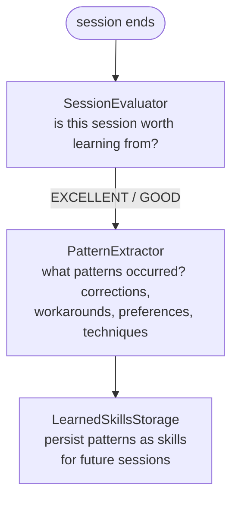

# Learning and Pattern Extraction

Attune AI continuously learns from your collaboration sessions. Each session
can be evaluated for quality, patterns extracted from it, and the learned
skills stored for future sessions. This means that corrections you make
("actually use YAML, not JSON"), workarounds you apply, and debugging
techniques that work all become part of Attune's working knowledge for
future sessions. This guide explains how the learning pipeline works and
how to access what Attune has learned.

---

## Overview

The learning pipeline has three stages:



The session end hook at `src/attune/hooks/scripts/evaluate_session.py`
runs this pipeline automatically after each session.

---

## Pattern Categories

Attune extracts seven types of patterns:

| Category | What It Captures | Example |
|----------|-----------------|---------|
| `error_resolution` | How specific errors were fixed | "When redis.ping() fails, check REDIS_URL env var first" |
| `user_correction` | "Actually, I meant..." moments | User redirected from JSON to YAML output |
| `workaround` | Framework quirk solutions | "PurePosixPath has no .exists() — use Path instead in tests" |
| `preference` | Response format / style signals | "User prefers concise answers over multi-paragraph explanations" |
| `project_specific` | Conventions unique to this project | "Always run ruff before git add in this repo" |
| `debugging_technique` | Effective debugging approaches | "Add --tb=short to pytest for large test suites" |
| `code_pattern` | Code-level conventions | "Use early returns instead of nested if blocks" |

---

## SessionEvaluator

Before extracting patterns, the evaluator scores the session:

```python
from attune.learning.evaluator import SessionEvaluator, SessionQuality

evaluator = SessionEvaluator()
result = evaluator.evaluate(collaboration_state)

print(f"Quality: {result.quality.value}")   # excellent, good, average, poor, skip
print(f"Score:   {result.score:.2f}")        # 0.0–1.0
print(f"Reason:  {result.reason}")
print(f"Patterns found: {result.pattern_count}")
```

**Quality ratings:**

| Rating | Score | Description |
|--------|-------|-------------|
| `excellent` | 0.8–1.0 | High interaction count, corrections, successful resolutions |
| `good` | 0.6–0.8 | Worth extracting patterns |
| `average` | 0.4–0.6 | Some value but low signal |
| `poor` | 0.2–0.4 | Limited learning value |
| `skip` | < 0.2 | Don't process |

---

## PatternExtractor

Extract patterns from a session marked as worth learning:

```python
from attune.learning.extractor import PatternExtractor, PatternCategory

extractor = PatternExtractor()
patterns = extractor.extract(collaboration_state)

for pattern in patterns:
    print(f"[{pattern.category.value}] {pattern.trigger}")
    print(f"  Resolution:  {pattern.resolution}")
    print(f"  Confidence:  {pattern.confidence:.2f}")
    print(f"  Tags:        {', '.join(pattern.tags)}")
```

### ExtractedPattern Fields

```python
@dataclass
class ExtractedPattern:
    category: PatternCategory     # One of the 7 types above
    trigger: str                  # What situation causes this pattern
    context: str                  # Surrounding context
    resolution: str               # What was done / learned
    confidence: float             # 0.0–1.0 extraction confidence
    source_session: str           # Session ID this came from
    tags: list[str]               # Searchable tags
```

---

## LearnedSkillsStorage

Patterns are persisted as `LearnedSkill` objects:

```python
from attune.learning.storage import LearnedSkillsStorage

storage = LearnedSkillsStorage(storage_dir=".attune/learned_skills")

# Save extracted patterns
skills = storage.save_patterns(patterns, session_id="session-abc123")
print(f"Saved {len(skills)} skills")

# Search for relevant patterns
# min_confidence=0.7 filters out low-signal patterns extracted
# from sessions with few corrections or ambiguous resolutions
relevant = storage.search(
    query="redis connection error",
    category="error_resolution",
    min_confidence=0.7,
    limit=5,
)
for skill in relevant:
    print(f"{skill.trigger}: {skill.resolution}")
```

### Skill Fields

```python
@dataclass
class LearnedSkill:
    skill_id: str           # Unique identifier
    category: str           # Pattern category
    trigger: str            # What activates this skill
    resolution: str         # What to do
    confidence: float       # How reliable this pattern is
    use_count: int          # How many times it's been applied
    source_sessions: list[str]
    tags: list[str]
    created_at: datetime
    last_used_at: datetime
```

---

## Viewing Learned Patterns

### Via CLI

```bash
# List all lessons (stored skills)
attune lessons

# Show full detail on a specific lesson
attune lessons --deep
```

### Via Python

```python
storage = LearnedSkillsStorage()

# All skills
all_skills = storage.get_all()
print(f"Total learned skills: {len(all_skills)}")

# By category
corrections = storage.get_by_category("user_correction")
print(f"User correction patterns: {len(corrections)}")

# Most-used patterns
frequent = storage.get_most_used(limit=10)
for skill in frequent:
    print(f"Used {skill.use_count}x: {skill.trigger}")
```

---

## Storage Location

Learned skills are stored in:

- **Global** (all projects): `~/.attune/learned_skills/`
- **Project-local**: `.attune/learned_skills/`

The session end hook respects the `--project` flag when saving to
project-local storage.

---

## Automatic Learning Setup

The learning pipeline runs automatically when the `evaluate_session.py`
hook is configured. It fires on `Stop` events (session end).

To check it's active:

```bash
cat .claude/settings.json | python3 -m json.tool | grep -A 3 "evaluate_session"
```

To trigger manually after a session:

```bash
python src/attune/hooks/scripts/evaluate_session.py
```

---

## See Also

- [Lessons CLI](../reference/cli-reference.md#attune-lessons) — View and
  manage learned patterns from the command line
- [Unified Memory System](unified-memory-system.md) — Long-term storage that
  surfaces learned patterns during future sessions automatically
