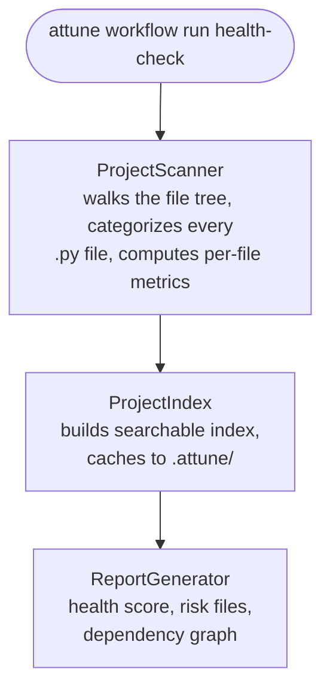

# Project Analysis and Code Metrics

The Attune AI project index scans your codebase and builds a structured
model of its files, dependencies, and code quality metrics. This powers
the `health-check` and `code-review` workflows under the hood.

Use this guide directly when you want to query project metrics
programmatically — for example, to find the highest-complexity files
before a refactoring sprint, to compute test-to-source ratios in a
script, or to integrate project health into a CI dashboard. For
one-off analysis, `attune workflow run health-check` is simpler.

---

## What the Project Index Does



---

## Quick Start

```python
from attune.project_index import ProjectIndex

# Initialize and scan the project
index = ProjectIndex(project_root=".")
index.scan()

summary = index.get_summary()
print(f"Total files:   {summary.total_files}")
print(f"Python files:  {summary.python_files}")
print(f"Test files:    {summary.test_files}")
print(f"Health score:  {summary.health_score:.0f}/100")
```

---

## File Categories

Every file is classified into one of these categories:

| Category | Description |
|----------|-------------|
| `SOURCE` | Production source code |
| `TEST` | Test files (`test_*.py`, `*_test.py`) |
| `CONFIG` | Configuration files |
| `DOCUMENTATION` | Markdown and text docs |
| `SCRIPT` | Utility scripts |
| `DATA` | Data files |
| `UNKNOWN` | Unclassified |

```python
from attune.project_index.models import FileCategory

source_files = index.get_files_by_category(FileCategory.SOURCE)
test_files   = index.get_files_by_category(FileCategory.TEST)

print(f"Source files: {len(source_files)}")
print(f"Test files:   {len(test_files)}")
print(f"Coverage ratio: {len(test_files)/len(source_files):.1%}")
```

---

## Code Metrics

For each Python file, the scanner computes:

| Metric | Description |
|--------|-------------|
| `line_count` | Total lines |
| `function_count` | Number of functions and methods |
| `class_count` | Number of class definitions |
| `complexity` | Average cyclomatic complexity |
| `import_count` | Number of import statements |
| `has_docstrings` | Whether public items have docstrings |

```python
# Get metrics for a specific file
record = index.get_file("src/attune/mcp/server.py")
if record:
    print(f"Lines:       {record.line_count}")
    print(f"Functions:   {record.function_count}")
    print(f"Classes:     {record.class_count}")
    print(f"Complexity:  {record.complexity:.1f}")
```

### Finding High-Complexity Files

```python
# Files sorted by complexity — candidates for refactoring
complex_files = sorted(
    index.get_files_by_category(FileCategory.SOURCE),
    key=lambda r: r.complexity,
    reverse=True,
)

print("Top 10 most complex files:")
for record in complex_files[:10]:
    print(f"  {record.path:50s}  complexity={record.complexity:.1f}")
```

---

## Dependency Analysis

```python
# What does a module import?
deps = index.get_dependencies("src/attune/mcp/server.py")
print("Direct imports:")
for dep in deps.direct:
    print(f"  {dep}")

# What imports a given module?
dependents = index.get_dependents("src/attune/security/path_validation.py")
print(f"Used by {len(dependents)} modules")
```

---

## Project Summary

```python
summary = index.get_summary()

print(f"Health score:        {summary.health_score:.0f}/100")
print(f"Total files:         {summary.total_files}")
print(f"Python files:        {summary.python_files}")
print(f"Test coverage ratio: {summary.test_coverage_ratio:.0%}")
print(f"Avg complexity:      {summary.avg_complexity:.2f}")
print(f"Files with docs:     {summary.documented_ratio:.0%}")
print(f"High-risk files:     {len(summary.high_risk_files)}")

# High-risk files flagged by the scanner
for f in summary.high_risk_files:
    print(f"  ⚠  {f.path}  (risk: {f.risk_score:.2f})")
```

---

## Index CLI

The project index ships its own CLI for one-off analysis:

```bash
# Scan and save index
python -m attune.project_index refresh

# Show summary table
python -m attune.project_index summary

# Full text report
python -m attune.project_index report

# Query specific files
python -m attune.project_index query "auth"

# Show one file's record
python -m attune.project_index file src/attune/mcp/server.py
```

---

## Incremental Scanning

The index caches results to `.attune/project_index.json`. On subsequent
calls, only modified files are re-scanned.

```python
# Full rescan
index.scan(force=True)

# Incremental (default)
index.scan()
print(f"Last scanned: {index.last_scanned_at}")
```

---

## Integration with Workflows

The `health-check` and `code-review` workflows use the project index
internally. Run them directly through their workflow classes:

```python
from attune.workflows import OrchestratedHealthCheckWorkflow

report = await OrchestratedHealthCheckWorkflow().execute(path=".")
print(report)
```

```python
from attune.workflows import CodeReviewWorkflow

result = await CodeReviewWorkflow().execute(path="src/attune")
print(result)
```

To inspect the underlying index yourself, scan it directly with
`ProjectIndex` as shown in the Quick Start section above:

```python
from attune.project_index import ProjectIndex

index = ProjectIndex(project_root=".")
index.scan()
summary = index.get_summary()
print(f"Health score: {summary.health_score:.0f}/100")
```

---

## See Also

- [health-check workflow](../reference/API_REFERENCE.md) — The
  primary consumer of project index data
- [code-review workflow](../reference/API_REFERENCE.md) — Uses
  metrics for prioritizing review focus
- [Practical Patterns](practical-patterns.md) — Code quality patterns and
  refactoring guidance
