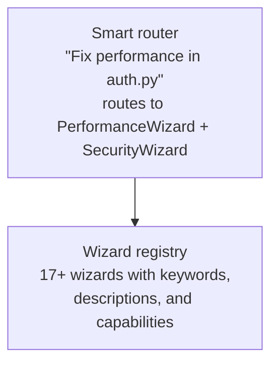

# Smart Router

The Smart Router enables natural language wizard dispatch - instead of knowing wizard names, developers describe what they need and the router figures out which wizard(s) to invoke.

## Quick Start

```python
from attune.routing import SmartRouter

router = SmartRouter()

# Natural language routing
decision = router.route_sync("Fix the security issue in auth.py")
print(f"Primary: {decision.primary_wizard}")      # → security-audit
print(f"Secondary: {decision.secondary_wizards}")  # → [code-review]
print(f"Confidence: {decision.confidence}")        # → 0.85
```

## How It Works



The router uses a keyword-based classifier to match requests to wizards. Each wizard is registered with:

- **Name**: Unique identifier (e.g., `security-audit`)
- **Description**: What the wizard does
- **Keywords**: Terms that trigger this wizard

## Routing Methods

### route_sync() / route()

Route a natural language request to wizard(s):

```python
# Synchronous
decision = router.route_sync("Check for SQL injection vulnerabilities")

# Asynchronous
decision = await router.route("Optimize slow database queries")
```

### suggest_for_file()

Get wizard suggestions based on a file path:

```python
# Python file → security, code-review
suggestions = router.suggest_for_file("src/auth.py")

# Package.json → dependency-check
suggestions = router.suggest_for_file("package.json")

# Dockerfile → security-audit
suggestions = router.suggest_for_file("Dockerfile")
```

### suggest_for_error()

Get wizard suggestions based on an error message:

```python
# Null reference → bug-predict
suggestions = router.suggest_for_error("NullPointerException at line 42")

# Security error → security-audit
suggestions = router.suggest_for_error("SecurityException: Access denied")
```

## RoutingDecision

The router returns a `RoutingDecision` with:

```python
@dataclass
class RoutingDecision:
    primary_wizard: str          # Best matching wizard
    secondary_wizards: List[str] # Related wizards to consider
    confidence: float            # 0.0-1.0 match confidence
    reasoning: str               # Why this routing was chosen
    suggested_chain: List[str]   # Recommended execution order
    context: Dict                # Preserved context from request
    classification_method: str   # "keyword" or "llm"
    request_summary: str         # Original request
```

## Context Preservation

Pass context through to the wizard:

```python
decision = router.route_sync(
    "Review this code",
    context={
        "file": "auth.py",
        "language": "python",
        "team": "backend"
    }
)

# Context is preserved in decision.context
print(decision.context)  # {"file": "auth.py", ...}
```

## List Available Wizards

```python
wizards = router.list_wizards()
for wizard in wizards:
    print(f"{wizard.name}: {wizard.description}")
    print(f"  Keywords: {wizard.keywords}")
```

## Integration with Chain Executor

The Smart Router works seamlessly with auto-chaining:

```python
from attune.routing import SmartRouter, ChainExecutor

router = SmartRouter()
executor = ChainExecutor()

# Route the request
decision = router.route_sync("Security review of auth module")

# Execute the suggested chain
for wizard_name in decision.suggested_chain:
    print(f"Running: {wizard_name}")
```

## Confidence Thresholds

Route only when the router is confident enough:

```python
decision = router.route_sync("Fix the issue")

if decision.confidence < 0.6:
    # Too ambiguous — ask for clarification
    print("Ambiguous request. Did you mean:")
    print(f"  {decision.primary_wizard}: {decision.reasoning}")
    for alt in decision.secondary_wizards[:2]:
        print(f"  {alt}")
elif decision.confidence < 0.90:
    # Moderate confidence — confirm before running
    print(f"Routing to: {decision.primary_wizard} (confidence: {decision.confidence:.0%})")
    confirm = input("Proceed? [y/n] ")
    if confirm.lower() != "y":
        return
else:
    # High confidence (0.90+) — run directly without confirmation
    pass
```

**Confidence ranges:**

| Range | Interpretation |
|-------|----------------|
| 0.90+ | Unambiguous — safe to run without confirmation |
| 0.60–0.89 | Good match — confirm before running |
| < 0.60 | Low — request is ambiguous; ask for clarification |

---

## Real-World Integration Patterns

### Pattern 1: CLI Dispatcher

Route a user's natural language command to the right workflow:

```python
import asyncio
from attune.routing import SmartRouter

async def run_from_description(description: str, path: str = "."):
    router = SmartRouter()
    decision = await router.route(description)

    if decision.confidence < 0.6:
        print(f"Not sure what to run. Best guess: {decision.primary_wizard}")
        print(f"Reason: {decision.reasoning}")
        return

    # Map the router's suggestion to a concrete workflow class
    from attune.workflows import SecurityAuditWorkflow, CodeReviewWorkflow

    workflows = {
        "security-audit": SecurityAuditWorkflow,
        "code-review": CodeReviewWorkflow,
    }
    workflow_cls = workflows.get(decision.primary_wizard, CodeReviewWorkflow)
    result = await workflow_cls().execute(path=path)
    print(result)

asyncio.run(run_from_description("Check for security issues in my API code"))
```

### Pattern 2: Multi-Wizard Fan-Out

Run the primary wizard and all secondaries when the primary is a strong match.
The secondary list is always narrower in scope than the primary, so a
high primary confidence is a reasonable proxy for running them all:

```python
from attune.workflows import SecurityAuditWorkflow, CodeReviewWorkflow

workflows = {
    "security-audit": SecurityAuditWorkflow,
    "code-review": CodeReviewWorkflow,
}

decision = router.route_sync("Full quality pass on authentication module")

# Run secondaries only when the overall routing is high-confidence
wizards_to_run = [decision.primary_wizard] + (
    decision.secondary_wizards if decision.confidence > 0.75 else []
)

for wizard_name in wizards_to_run:
    print(f"→ Running {wizard_name}...")
    workflow_cls = workflows.get(wizard_name, CodeReviewWorkflow)
    result = await workflow_cls().execute(path="src/auth/")
    print(f"  {result}")
```

### Pattern 3: File-Based Auto-Routing

Automatically route to the right wizard when a file changes:

```python
def on_file_changed(filepath: str):
    router = SmartRouter()

    # suggest_for_file uses file extension and path heuristics
    suggestions = router.suggest_for_file(filepath)

    if suggestions:
        primary = suggestions[0]
        print(f"Changed: {filepath} → suggested: {primary}")
        run_wizard(primary, filepath)
```

### Pattern 4: Error-Driven Routing

Route to the appropriate wizard based on an error message:

```python
def on_test_failure(error_output: str):
    router = SmartRouter()
    suggestions = router.suggest_for_error(error_output)

    # Most test failures → bug-predict or code-review
    if suggestions:
        decision = router.route_sync(f"Fix this error: {error_output[:200]}")
        return decision.primary_wizard
    return "bug-predict"  # safe default
```

---

## CLI Usage

The smart router is accessible from the CLI via natural language workflow
dispatch:

```bash
# Run the router's suggestion directly
attune workflow run "$(attune route 'check security in auth module')"

# Or use the meta-router directly
attune route "Fix performance in the database layer"
# → Suggests: perf-audit (0.88 confidence)
```

---

## See Also

- [Auto-Chaining](auto-chaining.md) — Automatic wizard sequencing
- [Telemetry and Signals](telemetry-and-signals.md) — Monitor routing
  decisions over time with `attune telemetry routing-stats`
- [API Reference](../reference/API_REFERENCE.md) — Full API documentation
