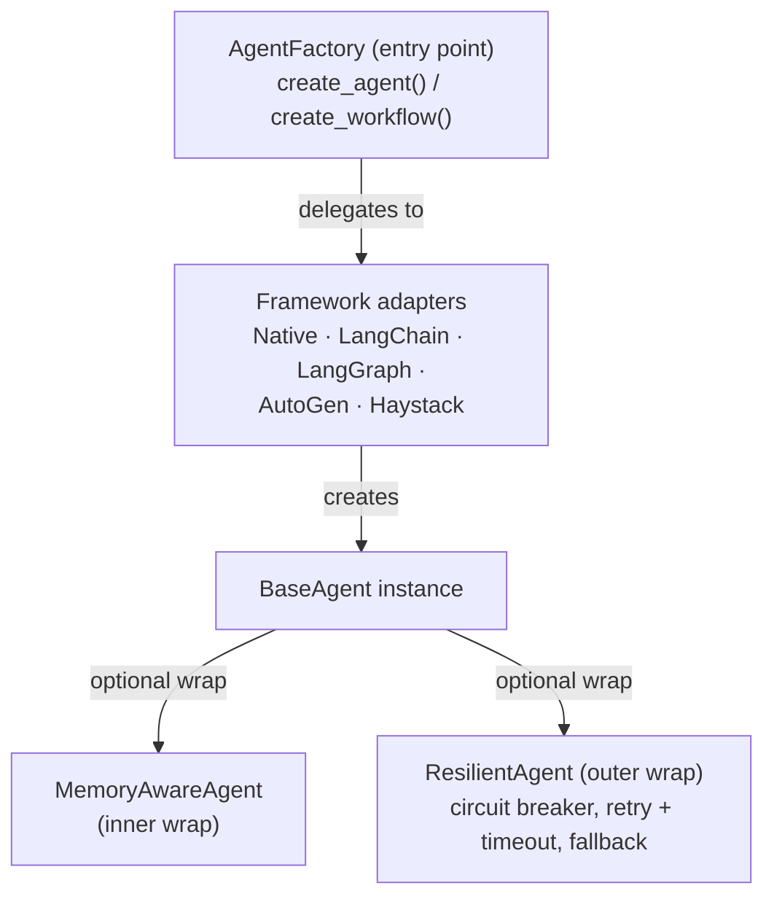

# Agent Factory Module Overview

The Agent Factory is a universal factory pattern implementation
that provides a framework-agnostic interface for creating agents
and workflows. It supports five agent frameworks while
maintaining a unified API with integrated cost optimization,
resilience patterns, and cross-agent learning.

---

## Architecture



When `resilience_enabled` is set, the framework adapter
creates the base agent and `ResilientAgent` wraps it, so
resilience patterns protect the agent call.

---

## Module Structure

```text
src/attune/agent_factory/
├── __init__.py              # Public API exports
├── base.py                  # Enums, configs, abstract classes
├── factory.py               # AgentFactory main class
├── framework.py             # Framework enum and detection
├── decorators.py            # Operation decorators
├── resilient.py             # ResilientAgent wrapper
└── adapters/
    ├── __init__.py          # Lazy-loading adapter registry
    ├── native.py            # Empathy native adapter
    ├── langchain_adapter.py # LangChain adapter
    ├── langgraph_adapter.py # LangGraph adapter
    ├── autogen_adapter.py   # Microsoft AutoGen adapter
    ├── haystack_adapter.py  # deepset Haystack adapter
    └── wizard_adapter.py    # Attune wizard adapter
```

---

## Design Patterns

| Pattern | Where | Purpose |
|---------|-------|---------|
| **Factory** | `AgentFactory` | Create agents/workflows via adapters |
| **Adapter** | `BaseAdapter` + implementations | Framework-specific agent creation |
| **Wrapper** | `ResilientAgent` | Add cross-cutting concerns |
| **Decorator** | `decorators.py` | Reusable operation enhancements |
| **Lazy Loading** | `adapters/__init__.py` | Optional deps loaded on demand |
| **Configuration Object** | `AgentConfig`, `WorkflowConfig` | Structured creation params |

---

## Supported Frameworks

| Framework | Use Case | External Deps |
|-----------|----------|---------------|
| **Native** | Simple agents, cost optimization | None |
| **LangChain** | Chains, tools, RAG, prompt templates | `langchain`, `langchain-anthropic` |
| **LangGraph** | Stateful multi-agent workflows | `langgraph`, `langchain-anthropic` |
| **AutoGen** | Conversational multi-agent teams | `pyautogen` |
| **Haystack** | Document QA, RAG, NLP pipelines | `haystack-ai` |

The factory auto-detects installed frameworks and recommends
the best one for a given use case. Native is always available
as a zero-dependency fallback.

---

## Integration Points

The Agent Factory integrates with these Attune subsystems:

- **ModelRouter** (`attune.routing`) — Resolves model tier
  (`cheap`/`capable`/`premium`) to specific model IDs based
  on the provider and task type
- **CircuitBreaker** (`attune.resilience`) — Provides
  circuit breaker state management for `ResilientAgent`
- **EmpathyLLM** — Powers the native adapter with built-in
  cost tracking and pattern learning

---

## Agent Roles

The factory provides 15 predefined roles organized into
three categories:

**Core:** Coordinator, Researcher, Writer, Reviewer, Editor,
Executor

**Specialized:** Debugger, Security, Architect, Tester,
Documenter

**RAG:** Retriever, Summarizer, Answerer

Plus `CUSTOM` for any other role.

---

## Resilience Patterns

When `resilience_enabled=True`, agents are wrapped with four
production-ready patterns:

1. **Circuit Breaker** — After N consecutive failures, the
   circuit opens and fast-fails for a cooldown period. Prevents
   cascading failures.
2. **Retry with Backoff** — Exponential backoff with jitter.
   Timeouts are not retried by default.
3. **Timeout** — Prevents hanging operations. Applied to both
   `invoke()` and `stream()`.
4. **Fallback** — Optional. Returns a configurable fallback
   response instead of raising.

---

## Decorators

Six reusable decorators for agent operations:

| Decorator | Purpose |
|-----------|---------|
| `@safe_agent_operation` | Logging, timing, error wrapping, audit trail |
| `@retry_on_failure` | Exponential backoff retry |
| `@log_performance` | Warn on slow operations |
| `@validate_input` | Require dict fields |
| `@with_cost_tracking` | Track token usage and costs |
| `@graceful_degradation` | Return fallback instead of raising |

All decorators are designed for async methods.

---

## Testing

Tests are in `tests/agent_factory/` and cover:

- Core factory creation and framework switching
- All enum values and config dataclasses
- Framework detection and recommendation
- Resilience wrapper (circuit breaker, retry, timeout)
- Memory integration (query, store, graph stats)
- Individual adapter behavior
