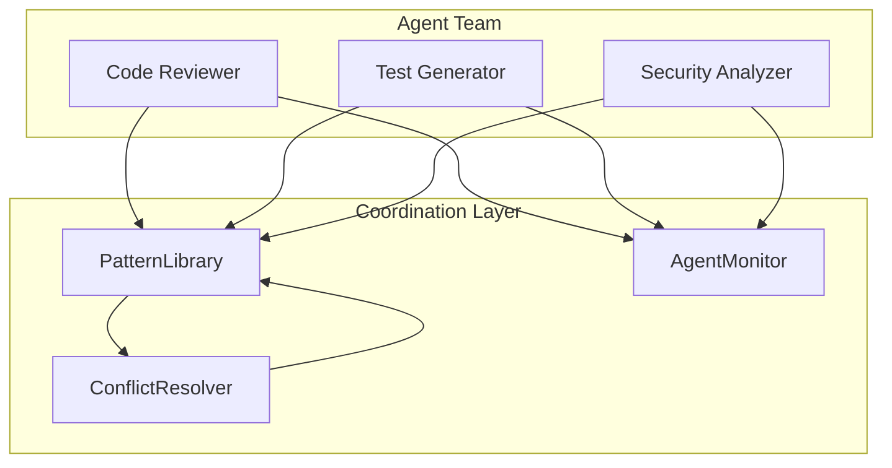

# Multi-Agent Coordination

Conflict resolution and monitoring for distributed agent teams.

## Overview

The Multi-Agent Coordination module enables:

- **Pattern Conflict Resolution**: When multiple agents discover conflicting patterns, resolve which takes precedence
- **Team Monitoring**: Track agent performance, collaboration efficiency, and system health
- **Shared Memory**: Coordinate agents via shared pattern libraries (see [Pattern Library](pattern-library.md))

## Architecture



## Quick Start

```python
from attune import PatternLibrary, AgentMonitor

# 1. Create shared infrastructure
library = PatternLibrary()
monitor = AgentMonitor(pattern_library=library)

# 2. Agents share a pattern library and report to the monitor
#    using consistent agent IDs (e.g. "code_reviewer",
#    "test_generator")

# 3. Agents discover and share patterns
# (Code reviewer finds a pattern, test generator can use it)

# 4. Monitor team collaboration
stats = monitor.get_team_stats()
print(f"Collaboration efficiency: {stats['collaboration_efficiency']:.0%}")
```

!!! warning "ConflictResolver removed in v6.8.0"

    The `ConflictResolver` / `ResolutionResult` / `TeamPriorities` classes
    were removed from `attune.coordination` (v6.8.0 breaking change, see
    [CHANGELOG](https://github.com/Smart-AI-Memory/attune-ai/blob/main/CHANGELOG.md)).
    They had no internal callers in attune-ai and were blocking Redis-free
    installs. If you depended on these classes, pin
    `attune-ai<6.8.0` or copy them from the v6.7.x source tree. The Redis
    plugin now ships bundled inside the attune-ai wheel (there is no
    separate `attune-redis` package on PyPI); its
    `attune_redis.signals.RedisSignalBus` provides the cross-agent
    signaling primitive.

---

## AgentMonitor

Tracks agent performance and team collaboration metrics.

### Class Reference

::: attune.monitoring.AgentMonitor
    options:
      show_root_heading: false
      show_source: false
      heading_level: 4

### Recording Agent Activity

```python
from attune import AgentMonitor, PatternLibrary

library = PatternLibrary()
monitor = AgentMonitor(pattern_library=library)

# Record agent interactions
monitor.record_interaction("code_reviewer", response_time_ms=150.0)
monitor.record_interaction("code_reviewer", response_time_ms=200.0)

# Record pattern discovery
monitor.record_pattern_discovery("code_reviewer", pattern_id="pat_001")

# Record cross-agent pattern reuse
monitor.record_pattern_use(
    agent_id="test_generator",
    pattern_id="pat_001",
    pattern_agent="code_reviewer",  # Original discoverer
    success=True
)
```

### Individual Agent Stats

```python
stats = monitor.get_agent_stats("code_reviewer")

print(f"Agent: {stats['agent_id']}")
print(f"Total interactions: {stats['total_interactions']}")
print(f"Avg response time: {stats['avg_response_time_ms']:.0f}ms")
print(f"Patterns discovered: {stats['patterns_discovered']}")
print(f"Success rate: {stats['success_rate']:.0%}")
print(f"Status: {stats['status']}")  # 'active' or 'inactive'
```

### Team-Wide Metrics

```python
team_stats = monitor.get_team_stats()

print(f"Active agents: {team_stats['active_agents']}")
print(f"Total agents: {team_stats['total_agents']}")
print(f"Shared patterns: {team_stats['shared_patterns']}")
print(f"Pattern reuse rate: {team_stats['pattern_reuse_rate']:.0%}")
print(f"Collaboration efficiency: {team_stats['collaboration_efficiency']:.0%}")
```

**Collaboration Efficiency** measures how effectively agents learn from each other:
- 0% = Agents only use their own patterns
- 100% = All pattern reuse is cross-agent

### Top Contributors

```python
# Find agents contributing most patterns
top = monitor.get_top_contributors(n=5)

for agent in top:
    print(f"{agent['agent_id']}: {agent['patterns_discovered']} patterns")
```

### Health Monitoring

```python
health = monitor.check_health()

print(f"Status: {health['status']}")  # 'healthy', 'degraded', or 'unhealthy'
print(f"Issues: {health['issues']}")
print(f"Active agents: {health['active_agents']}")
print(f"Recent alerts: {health['recent_alerts']}")

# Alerts are generated automatically for:
# - Slow response times (>5 seconds)
# - No active agents
# - Low collaboration efficiency
```

---

## Data Classes

### AgentMetrics

::: attune.monitoring.AgentMetrics
    options:
      show_root_heading: false
      show_source: false
      heading_level: 4

Per-agent metrics:

```python
# Accessing raw metrics
metrics = monitor.agents["code_reviewer"]

print(metrics.total_interactions)
print(metrics.patterns_discovered)
print(metrics.avg_response_time_ms)  # Property
print(metrics.success_rate)          # Property
print(metrics.pattern_contribution_rate)  # Property
```

### TeamMetrics

::: attune.monitoring.TeamMetrics
    options:
      show_root_heading: false
      show_source: false
      heading_level: 4

Team-wide aggregated metrics:

```python
from attune.monitoring import TeamMetrics

metrics = TeamMetrics(
    active_agents=3,
    total_agents=5,
    shared_patterns=100,
    pattern_reuse_count=50,
    cross_agent_reuses=30
)

print(metrics.pattern_reuse_rate)       # 0.5 (50/100)
print(metrics.collaboration_efficiency)  # 0.6 (30/50)
```

---

## Sharing Patterns Across Agents

A shared `PatternLibrary` lets agents contribute and reuse each
other's patterns:

```python
from attune import PatternLibrary, Pattern

# Create shared library
library = PatternLibrary()

# Contribute a pattern discovered by one agent
pattern = Pattern(
    id="pat_001",
    agent_id="code_reviewer",
    pattern_type="best_practice",
    name="Test Pattern",
    description="A discovered pattern"
)
library.contribute_pattern("code_reviewer", pattern)

# Query patterns on behalf of another agent
matches = library.query_patterns(
    agent_id="test_generator",
    context={"language": "python"},
    min_confidence=0.7
)
```

---

## Best Practices

### 1. Use Consistent Agent IDs

```python
# Good: Descriptive, consistent naming
monitor.record_interaction("code_reviewer", response_time_ms=150.0)
monitor.record_interaction("test_generator", response_time_ms=120.0)

# Bad: Generic or inconsistent names
monitor.record_interaction("agent1", response_time_ms=150.0)
```

### 2. Monitor Collaboration Efficiency

```python
# Check regularly
team_stats = monitor.get_team_stats()

if team_stats["collaboration_efficiency"] < 0.3:
    print("Warning: Agents aren't learning from each other")
    # Consider: shared contexts, better pattern tagging
```

---

## See Also

- [Pattern Library](pattern-library.md) - Pattern storage, retrieval, and sharing
- [Configuration](config.md) - Agent configuration options
- [Persistence](persistence.md) - Backend storage for shared patterns
- [Agent Factory](../how-to/agent-factory.md) - Create custom agents
- [Multi-Agent Tutorial](../tutorials/examples/multi-agent-team-coordination.md) - Step-by-step example
- [Unified Memory System](../how-to/unified-memory-system.md) - Distributed memory concepts
