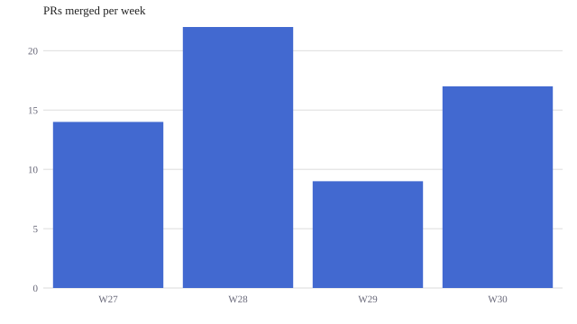
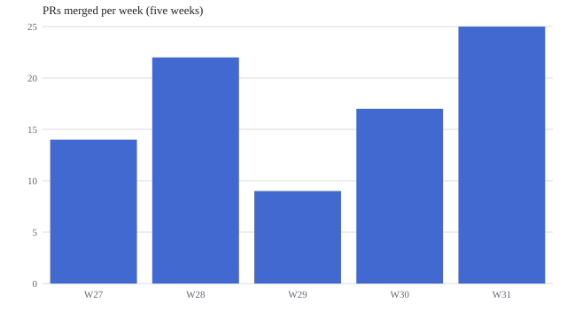
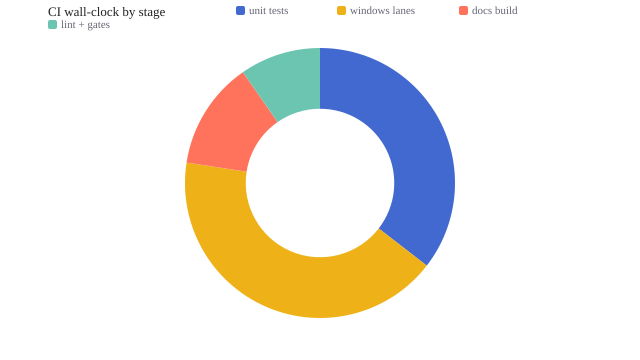
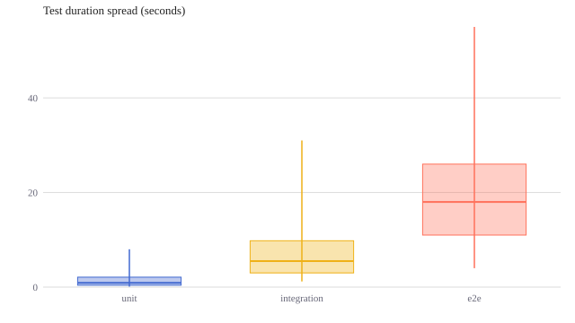
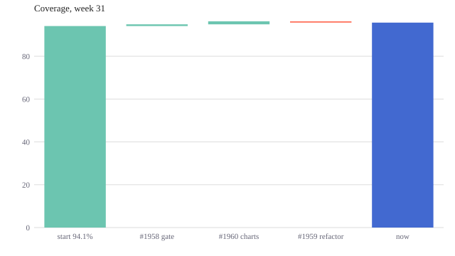
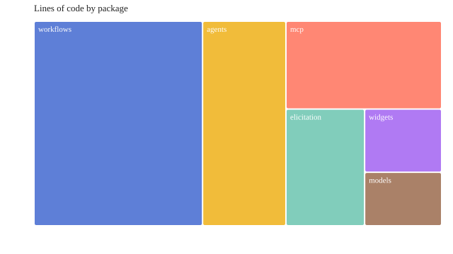

# Tutorial: Chart Widgets with Claude

You'll finish this tutorial having asked Claude for a chart and
watched what actually crosses the wire: a ~260-byte JSON spec, not
renderer code. Then you'll change the chart with a patch that costs
tens of bytes, tour the four chart types new in 11.3.0 (donut, box,
waterfall, treemap), export a chart as a standalone SVG, and cast a
reusable form template. Every number and error message below was
measured against a live 11.3.0 render — nothing is transcribed from
memory.

This page is the narrative walk-through. The contract itself — all
nine types, row shapes, options, the kernel seal — lives in the
[chartkit reference](../chartkit.md); cross-reference it as you go.

## Prerequisites

- Python 3.10 or newer
- `attune-ai` 11.3.0 or newer (`pip install -U attune-ai`)
- For the conversational flow: the attune-ai plugin in Claude Code
  (the `chart_render_widget` MCP tool ships with it)

Everything here also runs outside a Claude session — each step shows
the plain-Python equivalent, so you can follow along in a REPL.

## The idea in one paragraph

**chartkit** (the `chart_render_widget` MCP tool) splits chart-making
in two: the model authors a small declarative JSON spec, and a sealed
~10 KB JavaScript kernel — shipped inside the package, no CDN — turns
that spec into themable SVG. Claude never writes renderer code, so a
chart costs roughly 100 tokens to create. Updates are RFC 7386 JSON
Merge Patches against the stored spec, so changing a title costs ten.

## Step 1 — Ask for a chart

In a Claude Code session with the plugin, say:

```text
Chart our merged PRs per week: W27 14, W28 22, W29 9, W30 17.
```

Claude calls `chart_render_widget` with a stable `chart_id` and this
spec — the entire authored payload:

```json
{
  "v": 1,
  "type": "bar",
  "data": [
    {"week": "W27", "prs": 14},
    {"week": "W28", "prs": 22},
    {"week": "W29", "prs": 9},
    {"week": "W30", "prs": 17}
  ],
  "encodings": {
    "x": {"field": "week", "type": "nominal"},
    "y": {"field": "prs", "type": "quantitative"}
  },
  "options": {"title": "PRs merged per week"}
}
```

Measured: **260 bytes** as compact JSON — roughly 65 tokens. The tool
returns `{"success": true, "html": ..., "persistence": "stored — next
update may send a patch"}`, and the ~11 KB `html` (kernel + spec)
renders on the widget surface as:



The same call from plain Python:

```python
from attune.widgets.chart_widget_tool import render_chart_widget

spec = {...}  # the JSON above, as a Python dict
result = render_chart_widget("prs-weekly", spec=spec)
result["success"]      # True
result["persistence"]  # "stored — next update may send a patch"
```

Authoring mistakes fail field-level, not with a stack trace. Leave
out the y encoding and the whole result is
`{"success": False, "problems": ["encodings.y: Field required"]}` —
phrased so the calling model can fix its own spec and retry.

## Step 2 — Update it with a patch, not a new chart

Now say:

```text
Add W31 — 25 PRs — and retitle it to say five weeks.
```

Because the spec persisted under `chart_id`, Claude does **not**
re-send the widget. It sends a merge patch (RFC 7386: objects merge,
`null` deletes a key, arrays and scalars replace wholesale):

```json
{
  "data": [
    {"week": "W27", "prs": 14},
    {"week": "W28", "prs": 22},
    {"week": "W29", "prs": 9},
    {"week": "W30", "prs": 17},
    {"week": "W31", "prs": 25}
  ],
  "options": {"title": "PRs merged per week (five weeks)"}
}
```

Measured: **184 bytes** (~46 tokens) — arrays replace wholesale, so
the data rides along. A title-only patch,
`{"options": {"title": "Merged PRs, weekly"}}`, measures **42 bytes**
— about ten tokens for a live edit:



```python
result = render_chart_widget(
    "prs-weekly",
    patch={"options": {"title": "Merged PRs, weekly"}},
)
```

Degradation is legible, never silent: specs persist in session memory
with an 8-hour TTL, and when no backend is reachable the tool refuses
the patch and says exactly why — "Chart persistence is unavailable
(no memory backend reachable) … Re-send the FULL chart spec for this
chart_id instead of a patch."

## Step 3 — The 11.3.0 types

Four types joined `bar`, `line`, `scatter`, `area`, and `heatmap` in
11.3.0. Each is the same grammar — only the row shape changes. All
four specs below measured between 322 and 395 bytes.

### Donut — share of a whole

```text
Where does our CI wall-clock go? unit tests 11 min, windows lanes
13, docs build 4, lint and gates 3. Donut, please.
```

`encodings.y` carries the positive slice value (322-byte spec):



### Box — distribution, five stats per row

Box rows carry **pre-computed** `min`, `q1`, `median`, `q3`, `max` —
the kernel never aggregates raw samples; you (or Claude) summarize
first. Forget a stat and the render fails with a problem naming the exact
row and key: "spec: Value error, data.0.max: box rows need numeric
min, q1, median, q3, max (pre-computed summary stats — the kernel
never aggregates)".

```json
{
  "v": 1,
  "type": "box",
  "data": [
    {"suite": "unit", "min": 0.1, "q1": 0.4, "median": 0.9,
     "q3": 2.1, "max": 8.0},
    {"suite": "integration", "min": 1.2, "q1": 3.0, "median": 5.5,
     "q3": 9.8, "max": 31.0},
    {"suite": "e2e", "min": 4.0, "q1": 11.0, "median": 18.0,
     "q3": 26.0, "max": 55.0}
  ],
  "encodings": {
    "x": {"field": "suite", "type": "nominal"},
    "y": {"field": "median", "type": "quantitative"}
  },
  "options": {"title": "Test duration spread (seconds)"}
}
```



### Waterfall — signed deltas to a total

`encodings.y` is a signed delta; bars run at a cumulative offset,
colored by sign, and `options.total` appends a computed total bar
with your label:

```json
{
  "v": 1,
  "type": "waterfall",
  "data": [
    {"change": "start 94.1%", "delta": 94.1},
    {"change": "#1958 gate", "delta": 0.8},
    {"change": "#1960 charts", "delta": 1.4},
    {"change": "#1959 refactor", "delta": -0.6}
  ],
  "encodings": {
    "x": {"field": "change", "type": "nominal"},
    "y": {"field": "delta", "type": "quantitative"}
  },
  "options": {"title": "Coverage, week 31", "total": "now"}
}
```



### Treemap — magnitude as area

Rows are label + positive value, same shape as donut; the kernel
lays out proportional tiles:



## Step 4 — Export a static SVG (and the white page that isn't a bug)

The widget `html` needs JavaScript to draw — the kernel runs in the
page. **Opening a saved widget file in macOS Quick Look, or any
no-JS surface, shows a white page. That is expected, not a bug.**

For README badges, PyPI pages, or docs (like this one), export the
drawn SVG instead. Open the saved HTML in a real browser, then in
the developer console:

```js
copy(document.querySelector("svg").outerHTML
  .replace(/var\(--[a-z0-9-]+,\s*(#[0-9a-fA-F]{3,8})\)/g, "$1"));
```

The `.replace` flattens the kernel's theme variables
(`var(--chartkit-c1, #4269d0)`) to their hex fallbacks so the SVG is
self-contained. The bar chart above exports to a **2,244-byte**
standalone `.svg`; every image in this tutorial was produced exactly
this way.

## Step 5 — Cast a form template

Charts are the *display* half of attune's communication grammar. The
*interactive* half — forms Claude asks you — gained the same
economy in 11.3.0: the V7 form-template library. Sculpt a recurring
form once as a JSON template; cast it per use with slot values.

```python
from attune.elicitation import form_from_template

form = form_from_template("session-contract", {"project": "acme-api"})
form.title  # "Session contract — acme-api"
```

The cast form has four fields (mode, outcome, done-when, effort cap)
and renders on the same widget surface as any hand-built form.
Below is that exact cast, embedded live — this is the real renderer's
output, not a screenshot (on this static page the submit button will
tell you it needs a widget-capable session; that legible degradation
is itself part of the design):

<div style="border: 1px solid #d8b89a; border-radius: 8px; padding: 0 1rem; margin: 1rem 0;">
<h2 class="sr-only">Session contract — acme-api — interactive form</h2>
<form id="attune-elicit-form-d852a71d" data-form-title="Session contract — acme-api">
<style>
#attune-elicit-form-d852a71d { display:block; width:100%; padding:1rem 0;
  color:var(--text-primary,#2c2c2a); line-height:1.5; }
#attune-elicit-form-d852a71d .sr-only { position:absolute; width:1px; height:1px;
  overflow:hidden; clip:rect(0 0 0 0); }
#attune-elicit-form-d852a71d h3 { font-size:18px; font-weight:500; margin:0 0 .25rem; }
#attune-elicit-form-d852a71d .ae-msg { margin:0 0 .5rem; color:var(--text-secondary,#5f5e59); }
#attune-elicit-form-d852a71d .ae-desc { margin:0 0 1rem; color:var(--text-muted,#8a887f);
  font-size:15px; }
#attune-elicit-form-d852a71d .ae-field { margin:0 0 1rem; }
#attune-elicit-form-d852a71d .ae-label { display:block; font-weight:500;
  margin:0 0 .35rem; }
#attune-elicit-form-d852a71d .ae-req { color:var(--text-accent,#a1571c); margin-left:2px; }
#attune-elicit-form-d852a71d .ae-confirm { font-size:14px; color:var(--text-secondary,#5f5e59);
  border-left:3px solid var(--border-accent,#d8b89a); border-radius:0;
  padding:.35rem .6rem; margin:0 0 1rem; }
#attune-elicit-form-d852a71d .ae-inferred { font-size:13px; color:var(--text-muted,#8a887f);
  margin:0 0 .35rem; }
#attune-elicit-form-d852a71d .ae-inferred-b { display:inline-block; font-size:11px;
  font-weight:500; text-transform:uppercase; letter-spacing:.04em;
  color:var(--text-accent,#a1571c); background:var(--bg-accent,#f3ece4);
  border:1px solid var(--border-accent,#d8b89a); border-radius:var(--radius,8px);
  padding:0 .35rem; margin-right:.4rem; }
#attune-elicit-form-d852a71d .ae-help { font-size:13px; color:var(--text-muted,#8a887f);
  margin:0 0 .35rem; }
#attune-elicit-form-d852a71d .ae-submit { margin-top:.5rem; padding:.55rem 1.1rem;
  font-size:15px; font-weight:500; cursor:pointer; color:var(--text-primary,#2c2c2a);
  background:var(--bg-accent,#f3ece4); border:1px solid var(--border-accent,#d8b89a);
  border-radius:var(--radius,8px); }
#attune-elicit-form-d852a71d .ae-submit:disabled { opacity:.6; cursor:default; }
#attune-elicit-form-d852a71d .ae-error { margin-top:.5rem; font-size:14px;
  color:var(--text-accent,#a1571c); }
#attune-elicit-form-d852a71d .ae-input { width:100%; box-sizing:border-box;
  padding:.5rem .6rem; font-size:15px; color:var(--text-primary,#2c2c2a);
  background:var(--surface-1,#f7f6f3); border:1px solid var(--border,#e3e1dc);
  border-radius:var(--radius,8px); }
#attune-elicit-form-d852a71d .ae-textarea { resize:vertical; min-height:3.5rem; }
</style>
<h3>Session contract — acme-api</h3>
<p class="ae-desc">The session-start protocol&#x27;s fields. Fill before non-trivial work.</p>
<div class="ae-field" data-fid="mode" data-ftype="single_select"><label class="ae-label">Which mode is this session in?<span class="ae-req" title="required">*</span></label><select data-control class="ae-input"><option value="">— choose —</option><option value="Advancing a defined scope">Advancing a defined scope</option><option value="Executing a planned spec">Executing a planned spec</option><option value="Firefighting a CI/release issue">Firefighting a CI/release issue</option><option value="Meta-reflection / planning">Meta-reflection / planning</option></select></div><div class="ae-field" data-fid="outcome" data-ftype="text_input"><label class="ae-label">Outcome — what should be true after this session that isn&#x27;t true now?<span class="ae-req" title="required">*</span></label><div class="ae-help">One sentence.</div><input type="text" data-control class="ae-input"></div><div class="ae-field" data-fid="done_when" data-ftype="textarea"><label class="ae-label">Done when — the acceptance criteria.<span class="ae-req" title="required">*</span></label><div class="ae-help">Cheap to write, expensive to skip.</div><textarea data-control class="ae-input ae-textarea" rows="3" maxlength="500"></textarea></div><div class="ae-field" data-fid="effort_cap" data-ftype="text_input"><label class="ae-label">Effort cap — time or scope ceiling.</label><div class="ae-help">e.g. &#x27;30 min&#x27;, &#x27;one PR&#x27;, &#x27;no scope expansion past Phase 1&#x27;.</div><input type="text" data-control class="ae-input"></div>
<button type="button" id="ae-submit-d852a71d" class="ae-submit">Submit</button>
<div id="ae-error-d852a71d" class="ae-error" role="alert"></div>
<script>
(function() {
  var form = document.getElementById('attune-elicit-form-d852a71d');
  var btn = document.getElementById('ae-submit-d852a71d');
  var err = document.getElementById('ae-error-d852a71d');
  if (!form || !btn) return;
  btn.addEventListener('click', function() {
    var answers = {};
    form.querySelectorAll('.ae-field').forEach(function(f) {
      var fid = f.getAttribute('data-fid');
      var ftype = f.getAttribute('data-ftype');
      if (ftype === 'multi_select') {
        var vals = [];
        f.querySelectorAll('[data-control]:checked').forEach(function(c) {
          vals.push(c.value);
        });
        answers[fid] = vals;
      } else if (ftype === 'decision' || ftype === 'pushback' || ftype === 'progress') {
        // progress: the answer is the selected blocked item; when nothing
        // is blocked there is no radio and no answer is posted (display-only).
        var picked = f.querySelector('[data-control]:checked');
        if (picked) answers[fid] = picked.value;
      } else {
        var el = f.querySelector('[data-control]');
        if (!el) return;
        if (el.type === 'radio') {
          // single_select rendered as a list (list_style) — read the
          // checked radio, not the first control.
          var picked = f.querySelector('[data-control]:checked');
          if (picked) answers[fid] = picked.value;
        } else if (el.value !== '') {
          answers[fid] = (ftype === 'number') ? Number(el.value) : el.value;
        }
      }
    });
    var payload = { '__elicitation_response__': true,
      title: form.getAttribute('data-form-title'), answers: answers };
    if (typeof sendPrompt === 'function') {
      sendPrompt('Elicitation form submitted — parse and validate this '
        + 'response:\n```json\n' + JSON.stringify(payload) + '\n```');
      btn.disabled = true; btn.textContent = 'Submitted \u2713';
    } else {
      err.textContent = 'This surface cannot post back (sendPrompt '
        + 'unavailable). Use the AskUserQuestion fallback.';
    }
  });
})();
</script>
</form>
</div>

Validation is shared with hand-built forms — every problem listed,
none silently accepted:

```python
from attune.elicitation import FormValidationError

try:
    form_from_template("session-contract", {})
except FormValidationError as exc:
    exc.problems  # ["missing value for slot 'project'"]
```

Ask for a template that doesn't exist and the error tells you what
does: `unknown template 'release-signoff' — available:
session-contract`. When collecting answers, pass the template name
as `template_id` — responses from the same template share that join
key, so repeated casts become a comparable series across sessions:

```python
from attune.elicitation import collect_form_response

answers = {"mode": "Advancing a defined scope", "outcome": "..."}
response = collect_form_response(
    form, answers, template_id="session-contract"
)
```

## Where to go next

- [chartkit reference](../chartkit.md) — all nine types, row shapes,
  options, named components, and the kernel seal.
- [Diagrams](../diagrams.md) — when you need *structure* (modules,
  flows, schemas, states) instead of quantity, ask for a mermaid
  diagram; that page shows the types with live examples.
- [Elicitation forms](../reference/elicitation-forms.md) — the
  interactive grammar the template library builds on.
- The `elicit` skill's Step 0 catalogs available templates; a form
  earns templatehood on its second recurrence — no speculative
  templates.
