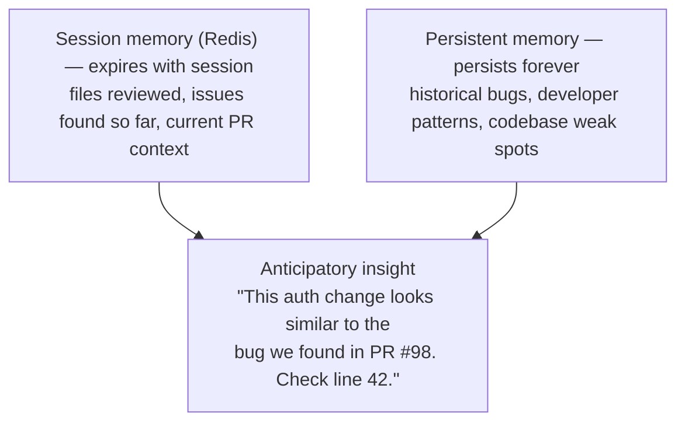

# Example: Code Review Assistant with Memory

**Difficulty**: Beginner → Intermediate
**Time**: 15 minutes
**Core Features**: Session memory (Redis), persistent memory, pattern
recall

---

## Overview

Build a **Code Review Assistant** that demonstrates the two storage
tiers that make Attune AI's memory powerful:

| Memory Tier | Storage | Purpose | Example |
|-------------|---------|---------|---------|
| **Session** | Redis | Active session context | "Which files have I reviewed in this PR?" |
| **Persistent** | Local store | Long-lived patterns | "What issues has this codebase had historically?" |

**What you'll learn**:

- **Session memory**: Track state within a session using `stash`
- **Persistent memory**: Remember patterns across sessions using
  `stage_pattern` and `search_patterns`
- **Combined power**: Anticipate issues by connecting session context
  with historical patterns

---

## Why Two Tiers of Memory?



---

## Quick Start

```bash
# Install with Redis support (default)
pip install attune-ai[full]

# Start Redis (required for session memory)
docker run -d -p 6379:6379 redis:alpine
```

---

## Part 1: The Review Assistant

`EmpathyLLM` is the chat/LLM class that powers a conversational
reviewer. Each call to `interact` returns a dict with the model's
reply and metadata.

```python
from attune.llm import EmpathyLLM

# Create a code review assistant
reviewer = EmpathyLLM(user_id="code_reviewer")

# Review the first file
result = reviewer.interact(
    user_id="code_reviewer",
    user_input="Review src/auth/login.py for security issues",
    context={"file": "src/auth/login.py"},
)

print("=== First File Review ===")
print(result["response"])

# Review a second file in the same conversation
result = reviewer.interact(
    user_id="code_reviewer",
    user_input="Now review src/auth/tokens.py",
    context={"file": "src/auth/tokens.py"},
)

print("\n=== Second File Review ===")
print(result["response"])
```

**Key Point**: The reviewer carries conversation state across calls,
so it can connect related files within a single review.

---

## Part 2: Session Memory (Redis)

Session memory tracks state **within a session**. Use `UnifiedMemory`
to stash and retrieve values that expire when the work is done.

```python
from attune.memory import UnifiedMemory

# Per-user memory (uses Redis when available, falls back to local)
memory = UnifiedMemory(user_id="code_reviewer")

session_id = "pr-142-review"

# Stash session state (optionally with a TTL)
memory.stash(
    f"{session_id}:files_reviewed",
    ["src/auth/login.py"],
    ttl_seconds=3600,
)

# Retrieve it later in the same session
files_reviewed = memory.retrieve(f"{session_id}:files_reviewed")

print("=== Session State ===")
print(f"Files reviewed: {files_reviewed}")
```

**Key Point**: Session memory lets the reviewer remember what it just
reviewed and track progress within a single session.

---

## Part 3: Persistent Memory (Patterns)

Persistent memory stores patterns **across sessions**. Stage a
pattern when you find an issue, then search for it in future reviews.

```python
from attune.memory import UnifiedMemory

memory = UnifiedMemory(user_id="code_reviewer")

# Record what happened during a review (PR #98, January)
memory.stage_pattern(
    {
        "description": "SQL injection vulnerability in login query",
        "file": "src/auth/login.py",
        "line": 42,
        "severity": "high",
        "pr_number": 98,
    },
    pattern_type="security_issue",
)

# ... weeks later, reviewing a new PR ...

# Surface historical patterns for the auth module
history = memory.search_patterns(
    query="src/auth/login.py",
    pattern_type="security_issue",
)

print("=== Auth Module History ===")
for pattern in history:
    print(f"  {pattern}")
```

**Key Point**: Persistent memory lets the reviewer learn from past
reviews, remember where bugs occurred, and warn about similar patterns
in new code.

---

## Part 4: Combining Both Tiers

The real power comes from **combining** session state with persistent
patterns. A single `UnifiedMemory` instance handles both.

```python
from attune.llm import EmpathyLLM
from attune.memory import UnifiedMemory

memory = UnifiedMemory(user_id="code_reviewer")
reviewer = EmpathyLLM(user_id="code_reviewer")

session_id = "pr-200-review"

# 1. Pull historical context (persistent memory)
history = memory.search_patterns(
    query="src/payments",
    pattern_type="security_issue",
)
print(f"Historical issues in payments/: {len(history)}")

# 2. Track this session (session memory)
memory.stash(f"{session_id}:status", "in_progress", ttl_seconds=3600)

# 3. Run the review (LLM)
result = reviewer.interact(
    user_id="code_reviewer",
    user_input="Review PR #200: Payment processing update",
    context={
        "session_id": session_id,
        "pr_number": 200,
        "files": ["src/payments/stripe.py", "src/payments/webhooks.py"],
        "history": history,
    },
)

print("=== Combined Memory Review ===")
print(result["response"])

# 4. Record any new finding for future reviews (persistent memory)
memory.stage_pattern(
    {
        "description": "API key exposed in error message",
        "file": "src/payments/stripe.py",
        "line": 78,
        "severity": "high",
    },
    pattern_type="security_issue",
)
```

---

## Part 5: Complete Working Example

Save as `code_review_assistant.py`:

```python
#!/usr/bin/env python3
"""Code Review Assistant - session and persistent memory.

Usage:
    python code_review_assistant.py <pr_number> <file1> [file2] ...
    python code_review_assistant.py 142 src/auth/login.py
"""

import sys

from attune.llm import EmpathyLLM
from attune.memory import UnifiedMemory


def main() -> None:
    if len(sys.argv) < 3:
        print(
            "Usage: python code_review_assistant.py "
            "<pr_number> <file1> [file2] ..."
        )
        sys.exit(1)

    pr_number = sys.argv[1]
    files = sys.argv[2:]

    print("Code Review Assistant")
    print("=" * 50)
    print(f"PR: #{pr_number}")
    print(f"Files: {', '.join(files)}")
    print()

    memory = UnifiedMemory(user_id="code_reviewer")
    reviewer = EmpathyLLM(user_id="code_reviewer")

    session_id = f"pr-{pr_number}-review"

    # Surface historical patterns for the files under review
    for file in files:
        history = memory.search_patterns(
            query=file, pattern_type="security_issue"
        )
        if history:
            print(f"Historical issues in {file}:")
            for pattern in history[:5]:
                print(f"   - {pattern}")
    print()

    # Interactive review loop
    print("Commands: 'review <file>', 'status', 'done'")
    print()

    while True:
        try:
            user_input = input("review> ").strip()

            if not user_input:
                continue

            if user_input.lower() == "done":
                print("\nReview complete!")
                break

            if user_input.lower() == "status":
                status = memory.retrieve(f"{session_id}:status")
                print(f"\nSession status: {status}")
                continue

            result = reviewer.interact(
                user_id="code_reviewer",
                user_input=user_input,
                context={
                    "session_id": session_id,
                    "pr_number": pr_number,
                    "files": files,
                },
            )

            print()
            print(result["response"])
            print()

            memory.stash(
                f"{session_id}:status", "in_progress", ttl_seconds=3600
            )

        except KeyboardInterrupt:
            print("\nReview cancelled")
            break


if __name__ == "__main__":
    main()
```

---

## Memory Value Summary

| Feature | Session (Redis) | Persistent |
|---------|-----------------|------------|
| **What it stores** | Current session state | Historical patterns |
| **Lifetime** | Session duration | Forever |
| **API** | `stash` / `retrieve` | `stage_pattern` / `search_patterns` |
| **Use case** | "What have I reviewed so far?" | "What bugs has this code had?" |
| **Example** | PR #142 review progress | "auth/ has had 5 security bugs" |

**The Magic**: When combined, the assistant can say:

> "You're reviewing auth code (session context) and this module has had
> 3 security issues in the past (persistent pattern). Line 52 looks
> similar to the bug we found in PR #98. Want me to flag it?"

---

## Next Steps

1. **Add GitHub integration** - Auto-post review comments
2. **Custom rules** - Add domain-specific review patterns
3. **Metrics** - Track review effectiveness over time

**Related examples**:

- [Multi-Agent Coordination](multi-agent-team-coordination.md) - Team
  review patterns

---

## Troubleshooting

**Redis not connected**

```bash
# Start Redis
docker run -d -p 6379:6379 redis:alpine
```

`UnifiedMemory` falls back to local storage when Redis is
unavailable, so persistent patterns still work without Docker.

**No historical patterns showing**

- Run a few review sessions first to build history
- Stage at least one pattern with `stage_pattern` before searching

---

**Need help?** See the [API Reference](../../reference/index.md).
